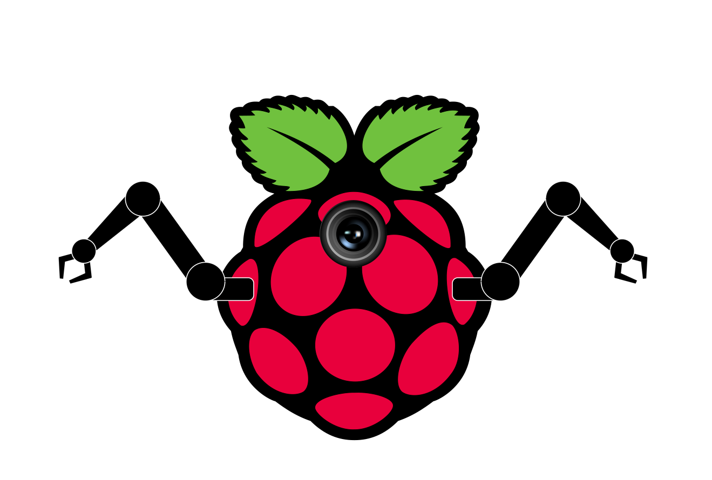

# pirov

Pirov is a software suit that turns a raspberry pi into a rov controller.

## Hardware
Once development becomes more advanced a list of recommended hardware and desings will be published for the use with this software.

## Installation
Complete instruction for the use of all scripts included in this project will be added soon.

